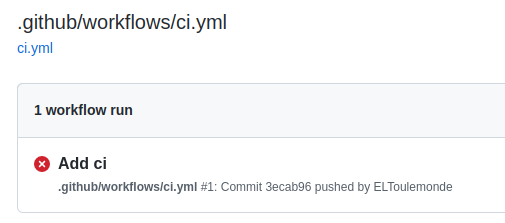

What is this?
-------------
At this step : 
- Your notebook is clean and running
- You have a few documented functions
- Your functions are in a specific `.py` file
- Your functions are tested
- Your package have a documentation

What is the goal ?
-------------------
The goal at this step is to create a CI with GitHub Actions.

To do so,  you need to create your own project on GitHub 
1. Create a GitHub Account (if you don't alreay have one)
2. Create an empty project
3. Change Git url 
    - You can see your current url by typing `git remote -v`
    - Change url to your GitHub repository with command `git remote set-url origin <<github ssh or https url>>`
4. Push the current branch to your repository `git push --set-upstream origin <<branchn_name>>`

Another alternative is to fork our repository (you still need to create an account and clic on fork) and clone it.

Once this is done, go to GitHub interface in "Actions" tab you should find a fail.


In this branch you have a file `.github/workflow/ci.yml`, your job now is to complete this CI to validate automatically your code at each push. 

Your goal is to complete the file so that your CI works and is green.

Tips: You should do it step by step, for each step
1. Test the command locally in your terminal
2. Put it in the `ci.yml` file
3. Push your code to validate that it works


When I'm done ?
---------------
You can explore all possibilities with [GitHub documentation](https://docs.github.com/en/actions/automating-builds-and-tests/building-and-testing-python)


Please remember to set remote back to the original one with command
```shell
git remote set-url origin git@github.com:octo-technology/Formation-MLOps-1.git
```

Or 
```shell
git remote set-url origin https://github.com/octo-technology/Formation-MLOps-1.git
```

When done, you can check out branch `6_add_github_actions_ci`
```shell
git stash
git checkout 6_add_github_actions_ci
```